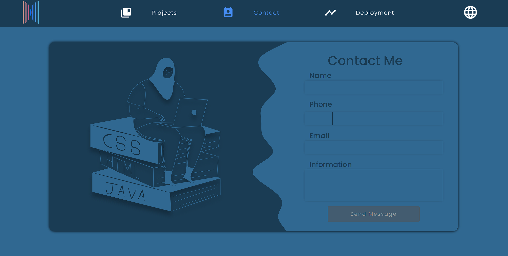
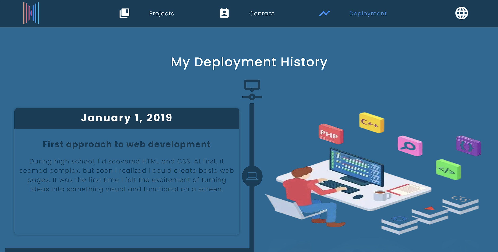

<!--proyect_tittle-->

# 👨‍💻 Personal Portfolio – Built with Angular 20 & Secure Express Integration

<!--proyect_image1_proyect_markdown/image1.gif-->

---

<!--proyect_subtitle_description-->

## ✨ Project Description

<!--proyect_content_description-->

This project is a **personal portfolio website** designed to showcase my skills, experience, and professional growth. Built entirely with **Angular 20**, it leverages **Server-Side Rendering (SSR)** for performance and SEO, **RxJS** for reactive data handling, and **Angular Material Icons** for a clean, modern UI.

The backend logic is securely integrated using **Express**, embedded directly within the Angular SSR pipeline to handle sensitive requests such as contact form submissions via the **Google API and Gmail**, ensuring privacy and control.

---

<!--proyect_subtitle_objective-->

## 🎯 Project Objective

<!--proyect_content_objective-->

The main goal of this portfolio is to **present my technical and creative capabilities** in a dynamic and interactive way. It serves as a central hub for recruiters, collaborators, and clients to learn about my background, contact me securely, and explore my professional timeline.

By combining modern frontend technologies with secure backend integration, the project reflects my commitment to elegant architecture, modular thinking, and intuitive user experience.

---

<!--proyect_subtitle_functionality-->

## 🧩 Core Functionality

<!--proyect_content_functionality-->

The portfolio is composed of three key sections:

1. **Intro animation:** A dynamic landing screen featuring a GIF that highlights my skills, tech stack, and personal branding.
2. **Contact form:** A minimal, secure form that connects to the Google API and Gmail for direct communication, protected by Express middleware.
3. **History timeline:** A visual timeline that displays my growth, milestones, and key achievements across a defined date range.

<!--proyect_image2_proyect_markdown/image2.png-->

<!--proyect_image3_proyect_markdown/image3.png-->

---

<!--proyect_subtitle_designUX-->

## 🖥️ Design and User Experience

<!--proyect_content_designUX-->

The interface is designed to be **clean, responsive, and symbolic**, using Angular Material Icons and custom styling to reflect clarity and professionalism. Animations and transitions are handled with Angular’s native tools, ensuring smooth navigation and visual feedback.

The layout adapts seamlessly across devices, and the timeline section uses intuitive scroll and hover interactions to highlight key moments in my career.

---

<!--proyect_subtitle_architecture-->

## 🏗️ Technical Architecture

<!--proyect_content_architecture-->

The project is built on a modular and secure architecture:

- **Frontend:**

  - Angular 20
  - Angular Universal (SSR)
  - RxJS for reactive streams
  - Angular Material Icons

- **Backend Integration:**

  - Express.js embedded in Angular SSR
  - Secure routing and middleware for API requests
  - Google API for Gmail-based contact handling

- **Security & Performance:**
  - Server-side rendering for SEO and speed
  - Middleware protection for sensitive endpoints
  - Form validation and sanitization

---

<!--proyect_subtitle_technologies-->

## 🔧 Technologies Used

<!--proyect_content_technologies-->

**Frontend:**

- Angular 20
- RxJS
- Angular Universal (SSR)
- Angular Material Icons

**Backend:**

- Express.js
- Google API (Gmail integration)
- Secure routing and middleware

**Infrastructure:**

- Node.js
- Server-side rendering
- HTTPS-ready deployment

---

<!--proyect_subtitle_contact-->

## 📬 Contact

<!--proyect_content_contact-->

**Email:**

- vielmassalais023@gmail.com

**Phone:**

- +52 (81) 3233-1206

**Social Media:**

- GitHub: [@CesarVielmas](https://github.com/CesarVielmas)
- LinkedIn: [Cesar Vielmas](https://www.linkedin.com/in/cesar-vielmas-324a9b218/)

---

<!--proyect_subtitle_footer-->

## Personal Portfolio

<!--proyect_content_footer-->

Crafted with precision, powered by Angular, and driven by vision 👨‍💻✨  
**Last updated:** September 4, 2025
