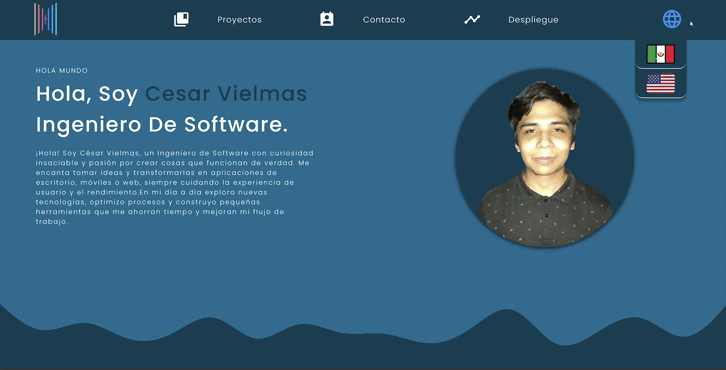
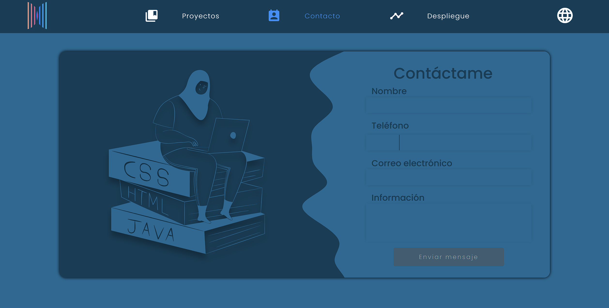
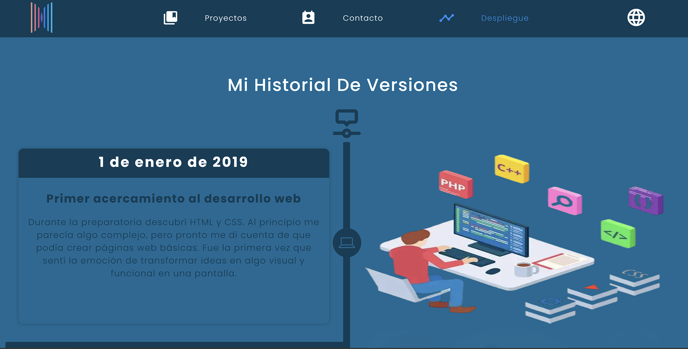

<!--proyect_tittle-->

# 👨‍💻 Portafolio Personal – Desarrollado con Angular 20 y Express Seguro

<!--proyect_image1_proyect_markdown/image1.gif-->

---

<!--proyect_subtitle_description-->

## ✨ Descripción del Proyecto

<!--proyect_content_description-->

Este proyecto es un **sitio web de portafolio personal** diseñado para mostrar mis habilidades, experiencia y crecimiento profesional. Desarrollado completamente con **Angular 20**, aprovecha el **renderizado del lado del servidor (SSR)** para mejorar el rendimiento y el SEO, **RxJS** para el manejo reactivo de datos, y **Angular Material Icons** para una interfaz moderna y limpia.

La lógica del backend está integrada de forma segura mediante **Express**, embebido directamente en el pipeline SSR de Angular para manejar solicitudes sensibles como el envío del formulario de contacto a través de la **API de Google y Gmail**, garantizando privacidad y control.

---

<!--proyect_subtitle_objective-->

## 🎯 Objetivo del Proyecto

<!--proyect_content_objective-->

El objetivo principal de este portafolio es **presentar mis capacidades técnicas y creativas** de forma dinámica e interactiva. Funciona como un punto central para reclutadores, colaboradores y clientes que deseen conocer mi trayectoria, contactarme de forma segura y explorar mi línea de tiempo profesional.

Al combinar tecnologías modernas de frontend con una integración backend segura, el proyecto refleja mi compromiso con la arquitectura elegante, el pensamiento modular y la experiencia de usuario intuitiva.

---

<!--proyect_subtitle_functionality-->

## 🧩 Funcionalidad General

<!--proyect_content_functionality-->

El portafolio está compuesto por tres secciones principales:

1. **Intro animado:** Pantalla de bienvenida dinámica con un GIF que destaca mis habilidades, stack tecnológico y branding personal.
2. **Formulario de contacto:** Formulario minimalista y seguro que se conecta con la API de Google y Gmail para comunicación directa, protegido por middleware de Express.
3. **Línea de tiempo:** Visualización cronológica que muestra mi crecimiento, logros y momentos clave en un rango de fechas definido.

<!--proyect_image2_proyect_markdown/image2.png-->

<!--proyect_image3_proyect_markdown/image3.png-->

---

<!--proyect_subtitle_designUX-->

## 🖥️ Diseño y Experiencia de Usuario

<!--proyect_content_designUX-->

La interfaz está diseñada para ser **limpia, responsiva y simbólica**, utilizando Angular Material Icons y estilos personalizados que transmiten claridad y profesionalismo. Las animaciones y transiciones se gestionan con herramientas nativas de Angular, asegurando navegación fluida y retroalimentación visual.

El diseño se adapta perfectamente a distintos dispositivos, y la sección de línea de tiempo utiliza interacciones intuitivas de desplazamiento y enfoque para resaltar momentos clave de mi carrera.

---

<!--proyect_subtitle_architecture-->

## 🏗️ Arquitectura Técnica

<!--proyect_content_architecture-->

El proyecto está construido sobre una arquitectura modular y segura:

- **Frontend:**

  - Angular 20
  - Angular Universal (SSR)
  - RxJS para flujos reactivos
  - Angular Material Icons

- **Integración Backend:**

  - Express.js embebido en SSR de Angular
  - Ruteo seguro y middleware para peticiones API
  - API de Google para manejo de contacto vía Gmail

- **Seguridad y Rendimiento:**
  - Renderizado del lado del servidor para SEO y velocidad
  - Protección de endpoints sensibles con middleware
  - Validación y sanitización de formularios

---

<!--proyect_subtitle_technologies-->

## 🔧 Tecnologías Utilizadas

<!--proyect_content_technologies-->

**Frontend:**

- Angular 20
- RxJS
- Angular Universal (SSR)
- Angular Material Icons

**Backend:**

- Express.js
- API de Google (integración con Gmail)
- Middleware seguro y ruteo protegido

**Infraestructura:**

- Node.js
- Renderizado del lado del servidor
- Despliegue con HTTPS

---

<!--proyect_subtitle_contact-->

## 📬 Contacto

<!--proyect_content_contact-->

**Correo electrónico:**

- vielmassalais023@gmail.com

**Teléfono:**

- +52 (81) 3233-1206

**Redes Sociales:**

- GitHub: [@CesarVielmas](https://github.com/CesarVielmas)
- LinkedIn: [Cesar Vielmas](https://www.linkedin.com/in/cesar-vielmas-324a9b218/)

---

<!--proyect_subtitle_footer-->

## Portafolio Personal

<!--proyect_content_footer-->

Creado con precisión, impulsado por Angular y guiado por visión 👨‍💻✨  
**Última actualización:** 4 de septiembre de 2025
